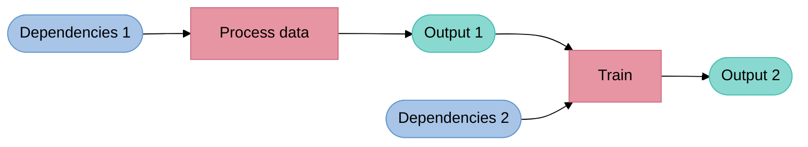
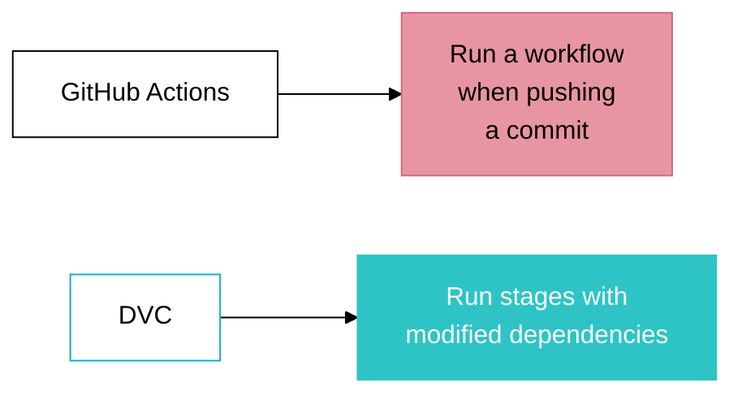
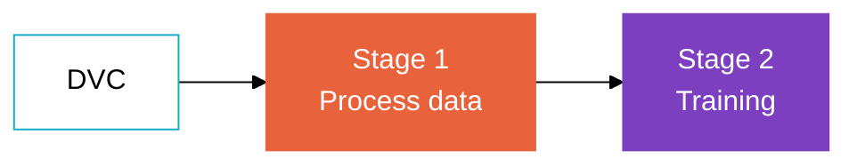

# Automatically Rerun Modified Components of a Pipeline with DVC and GitHub Actions (Part 1)

```mermaid
%%{init:{'theme':'base','themeVariables':{'background':'#ffffff'}}}%%
flowchart LR
    D1(["Dependencies 1"])
    P["Process data"]
    O1(["Output 1"])
    T["Train"]
    D2(["Dependencies 2"])
    O2(["Output 2"])

    D1 --> P
    P --> O1
    O1 --> T
    D2 --> T
    T --> O2

    style D1 fill:#a8c5e8,color:#000000,stroke:#6699cc
    style P fill:#e895a3,color:#000000,stroke:#cc6b7d
    style O1 fill:#8ad9d0,color:#000000,stroke:#4dbfb3
    style T fill:#e895a3,color:#000000,stroke:#cc6b7d
    style D2 fill:#a8c5e8,color:#000000,stroke:#6699cc
    style O2 fill:#8ad9d0,color:#000000,stroke:#4dbfb3
```

```mermaid
%%{init:{'theme':'base','themeVariables':{'background':'#ffffff'}}}%%
flowchart LR
    G["GitHub Actions"] --> A["Run a workflow<br/>when pushing<br/>a commit"]
    D["DVC"] --> B["Run stages with<br/>modified dependencies"]

    style G  fill:#ffffff,color:#000000,stroke:#000000
    style A fill:#e895a3,color:#000000,stroke:#cc6b7d
    style D fill:#ffffff,color:#000000,stroke:#13adc7
    style B fill:#2ec4c6,color:#ffffff,stroke:#2ec4c6
```

```mermaid
%%{init:{'theme':'base','themeVariables':{'background':'#ffffff'}}}%%
flowchart LR
    D["DVC"] --> S1["Stage 1<br/>Process data"]
    S1 --> S2["Stage 2<br/>Training"]

    style D fill:#ffffff,color:#000000,stroke:#13adc7
    style S1 fill:#e8623c,color:#ffffff,stroke:#e8623c
    style S2 fill:#7b3fbf,color:#ffffff,stroke:#7b3fbf
``` 