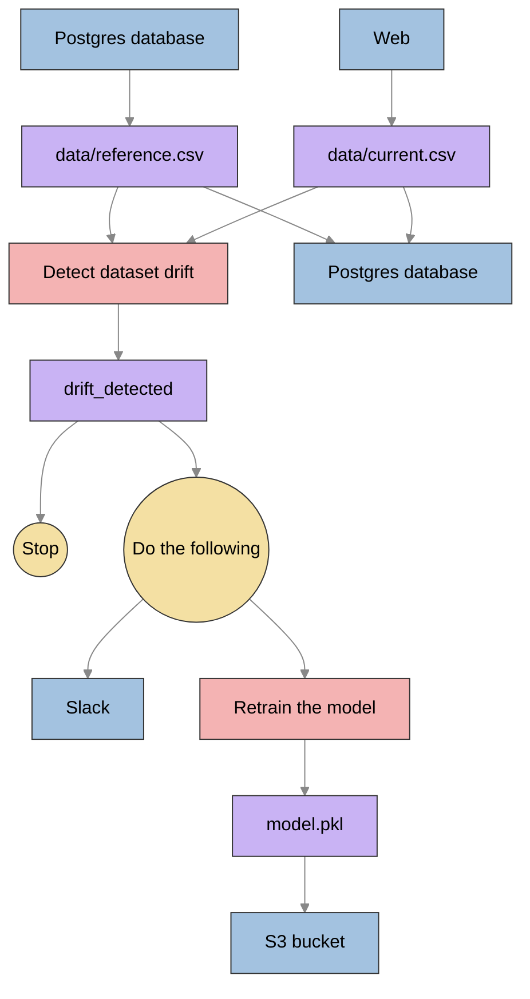
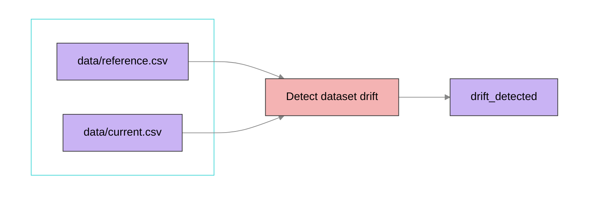
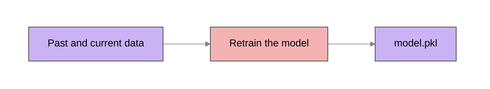
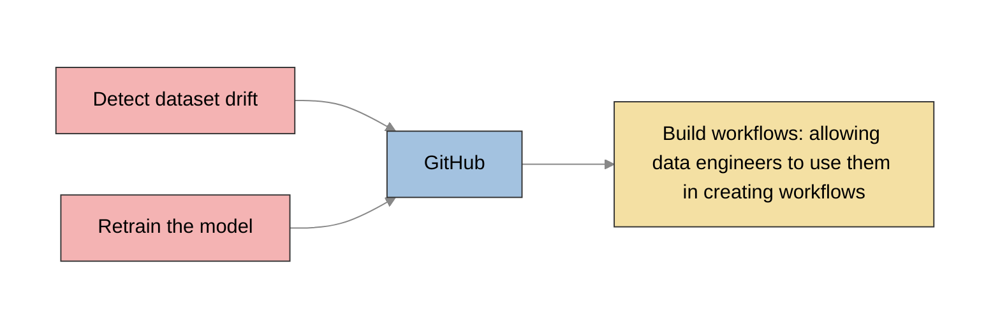

# Build a Fully Automated Data Drift Detection Pipeline



## Data Science Tasks

### Detect Data Drift


```python
from evidently.metric_present_ import DataDriftPresent
from evidently.report import Report
from krestra import Kestra

data_drift_report = Report(metrics=[DataDriftPresent()])
data_drift_report.run(reference_data=reference, current_data=current)

report = data_drift_report.as_dict()
drift_detected = report['metrics'][0]['result']['dataset_drift']

if drift_detected:
    print("Detect dataset drift")
else:
    print("No dataset drift detected")

kestra.outputs({'drift_detected': drift_detected})
```

### Retrain Model



### Push to Github



## Data Engineering Tasks

### Airflow

```python
from datetime import datetime

from airflow import DAG
from airflow.decorators import task
from airflow.operators.bash import BashOperator

with DAG(dag_id='demo', start_date=datetime(2023, 7, 31), schedule='0 11 * * 1')
    my_task = BashOperator(
        task_id='someTask', bash_command='echo Hello'
    )

    # Developed inside the orchestration logic
    @task()
    def data_science_task():
            print('bye')

    # Set dependencies between tasks
    my_task >> data_science_tasks()
```

### Kestra

- Developed outside of the orchestration logic
- Incorporated into data workflws into YAML files
  
```bash
docker compose up -d
```

### Kestra YAML Orchestration file

[Data Drift Kestra Orchestration](data_drift/data_drift_kestra.yaml)

### Buidl a flow to send Slack Mesaages

[Slack Messages Kestra Automation](data_drift/send_slack_messages.yaml)

### Build a flow to retrain the modfel

[Retrain Model Flow](data_drift/retrain_model.yaml)