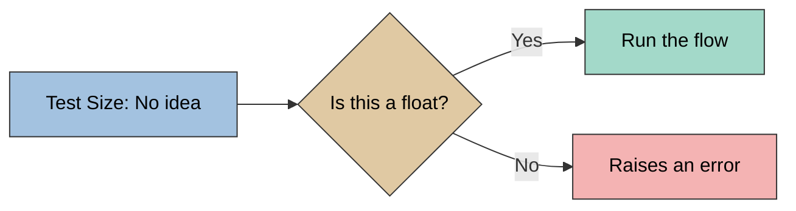
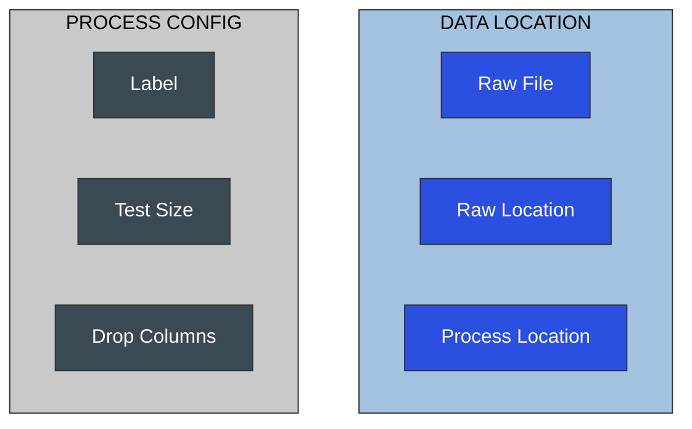

# Validate Python Tnput Values for a Machine Learning Application with Pydantic





## Pydantic

```python
from prefect import flow
from typing import List, Literal
from pydantic import BaseModel, validator

class DataLocation(BaseModel):
    raw_location: Literal["data/raw", "data/processed"] = "data/raw"
    raw_file: str = "iris.csv"
    process_location: Literal["data/raw", "data/processed"] = "data/processed"

class ProcessConfig(BaseModel):
    drop_columns: List[str] = ["Id"]
    label: str = "Species"
    test_size: float = 0.3

@flow
def process(
    data_location: DataLocation = DataLocation(),
    process_config: ProcessConfig = ProcessConfig()
):
    data = get_raw_dat(data_location.raw_location, data_location.raw_file)
    processed = drop_columns(data, process_config.drop_columns)
    X, y = get_X_y(processed, process_config.label)
    split_data = split_train_test(X, y, process_config.test_size)
    save_processed(split_data, data_location.process_location)

if __name__ = "__main__":
    process(test_size=0.4)
```

## Create Custom Validators

```python
from prefect import flow
from typing import List, Literal
from pydantic import BaseModel, validator

class ProcessConfig(BaseModel):
    drop_columns: List[str] = ["Id"]
    label: str = "Species"
    test_size: float = 0.3

    @validator("test_size")
    def must_be_non_negative(cls, v):
        if v < 0:
            raise ValueError(f"{v} must be non-negative")
        return v

if __name__ = "__main__":
    process(process_config=ProcessConfig(test_size=-0.5))


```