# Workflow Orchestration - Supercharge Your Data Pipeline in Python | Prefect

## Eliminate Negative Engineering wiht Prefect

### Machine Learning Pipeline

- Load Data > Process Data > Train Model > Make Prediction

### Positive Engineering

Focused entirely on writing the core logic that achieves the business goal 

### Negative Engineering

Extra defensive code and processes you must write to handle failures, erros and edge cases

### Prefect

- Open-source workflow orchestration
- Python-based
- Eliminate negative engineering

## Flow in Prefect

What is a Flow? 

- The basics of all Prefect workflows

### Functionalities of a Flow

1. Observability
2. Retries
3. Timeout
4. Effortlessly run your code concurrently or in parallel
5. Prerequisite to creating a deployment
    - Schedule
    - Send notifications

### How to turn your code into a Flow

```python

import pandas as pd
from prefect import flow

@flow
def process_data():
    ...

```

## Tasks in Prefect

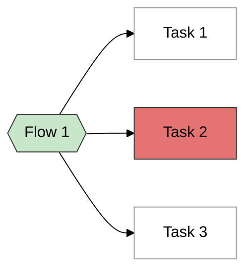

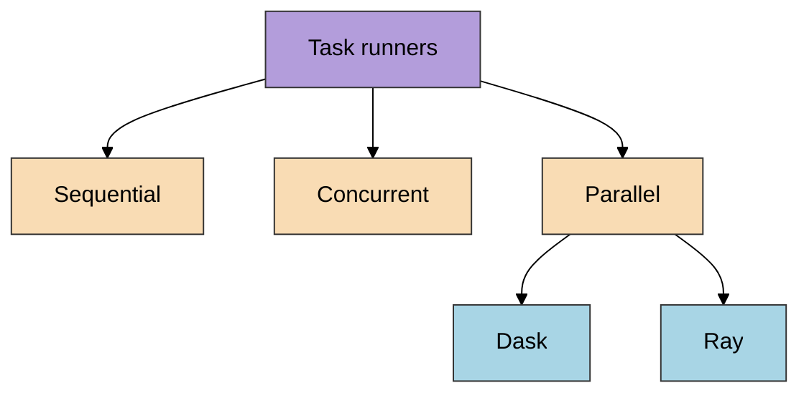

```python

from prefect import task

@task
def load_config(
    with initialize(version_base=None, config_path='../config')
        config = compose(config_name='main')

    return config
)

```

## Observe Data Pipelines through Prefect Orion Server

### View flow runs through Prefect UI

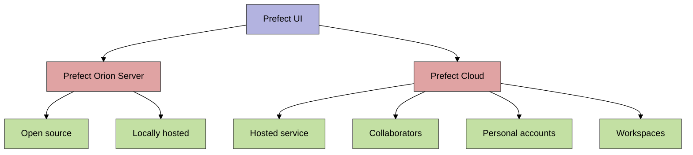

### Functionalities of Prefect UI

- Flow run summaries
- Task run details
- Flow and task dependency visualizer
- Logs

```bash
prefect orion start
```

## Subflows in Prefect: Organize Data Pipelines in Python

```python
from prefect import flow

@flow
def prepare_for_training():
    ...

@flow
def train():
    ...

@flow
def development():
    prepare_for_training()
    train()
```

### Flow and Subflow

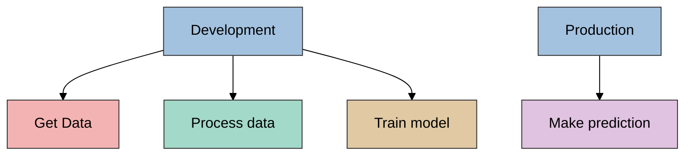

### Subflows or tasks

#### Use tasks when run tasks concurrently

```mermaid
%%{init: {'theme': 'base', 'themeVariables': { 'background': '#ffffff'}}}%%
gantt
    title Run tasks concurrently (CPU)
    dateFormat X
    axisFormat %s

    section Task 1
    Run : 0, 3
    Run : 5, 3

    section Task 2
    Run : 2, 3
    Run : 6, 2
```

#### Use flows when

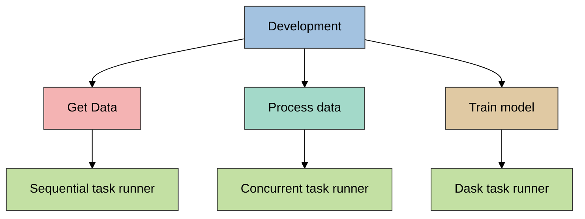

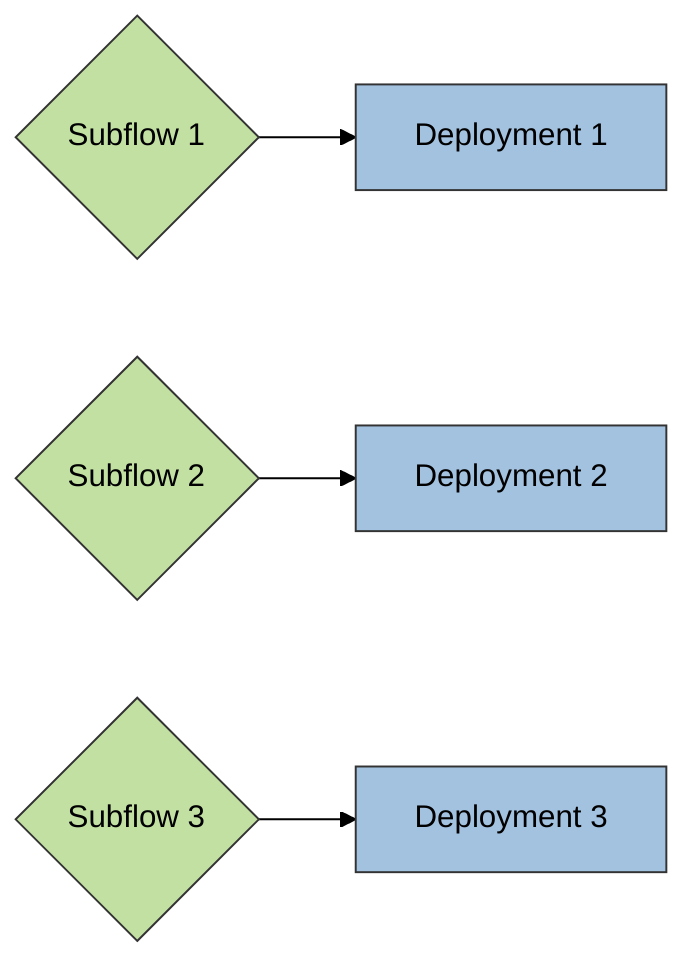

## Caching Your Python Functions


```python
from prefect import task

@task(cache_key_fn=task_input_hash, cache_expiration=...)
def load_config()
    ...
```

## Retries in Python: Rerun Failed Functions for a Specific Number of Times 

```python
from prefect import task

@task(retries=..., retry_delay_seconds=...)
def load_config()
    ...

```

## Schedule your Data Workflow

## Deploy a Data Pipeline (Part 1) - What is a Deployment

- Encapsulates a flow
- Allows it to be triggered via API

### Why Deployment

1. Turn a flow into an API
2. Specify infrastructure
3. Specify storage
4. Specify custom names/parameters in the UI
5. Schedule the flow run
6. Retry flow

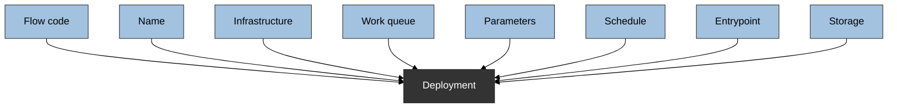

## Deploy a Data Pipeline (Part 3) - Create a Deployment

### How to deploy a flow

- Through a Python object
- Through a CLI

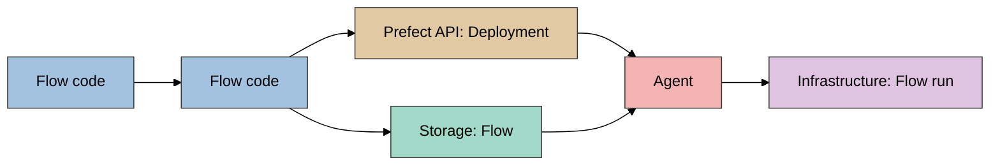

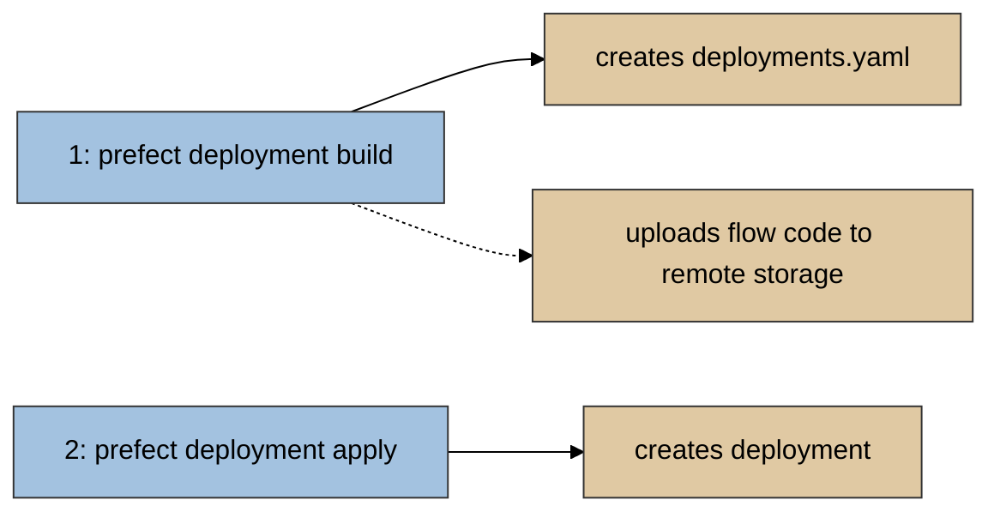

```bash
prefect deployment build [OPTIONS]
<path-to-your-flow>:<flow-name> -n <name-of-deployment> -a (apply option)

prefect deployment apply <name-of-deployment-yaml-file>
```

## Deploy a Data Pipeline (Part 3) - Run a Deployment

- Work Queue
- Agents

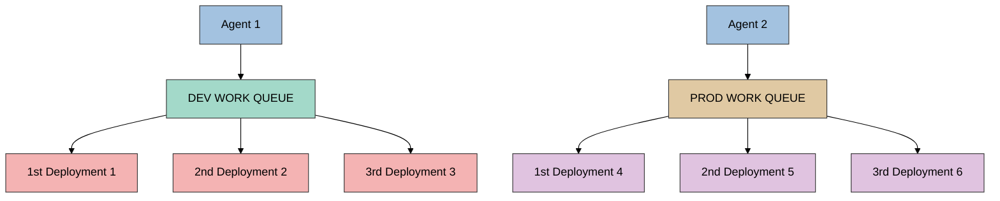

```mermaid
%%{init: {'theme': 'base', 'themeVariables': { 'background': '#ffffff'}}}%%
graph LR
    P[Python script] --> F[Create a flow]
    F --> UI[Prefect UI]
    UI --> DEP[Create a deployment]
    DEP --> WQ[Create a work queue]
    WQ --> AG[Start an agent]

    style P fill:#e0c9a3,stroke:#333,color:#000
    style F fill:#a3d9c9,stroke:#333,color:#000
    style UI fill:#f4b3b3,stroke:#333,color:#000
    style DEP fill:#a3d9c9,stroke:#333,color:#000
    style WQ fill:#e0c9a3,stroke:#333,color:#000
    style AG fill:#f4b3b3,stroke:#333,color:#000
```

```bash
prefect agent start -q 'default'

```

